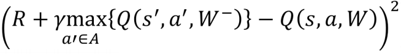
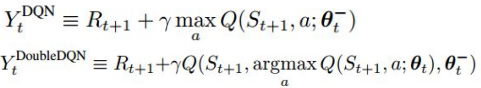
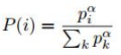
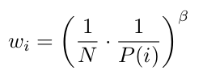

# DQN Agent
## Structure of project
### QNeuralNetwork.py
Q-network class implemented via Keras using Theano backend.  
Parameters: state/action dimensionality and batch size. They are initialized directly by agent.  
Programmer can make a network by editing "create_model" method or use prepared model.  
The network uses RMSpror optimizer with learning rate 0.0001 and optimizes MSE. 
### Agent_DQN.py 
Agent class implementation.  
This agent tries to approximate mapping from space of states  to space of q-values  using Q-network.  
The main idea is to minimize the squared temporal-difference error:  
  
using examples from experience, that contains last **buffer_size** transitions **(State, action, reward, next_state)** generated by on-policy distribution.
Policy of agent is e-greedy, agent acts greedy with probability 1-e and makes random action with probability e.
Agent use **frozen_network** to compute the target, whose weights are updated every **backup_steps**. Also every **backup_steps** steps agent saves Q-network's weights to file.  
[Read the full description of the algorithm here](https://www.cs.toronto.edu/~vmnih/docs/dqn.pdf)  
In fact there is no **next_state** in transitions in the xp-replay implementation because of memory efficiency, and the agent takes **next_state** from next transition's **state**. So agent doesn't optimize last memorized transition because there is no **next_state** in xp yet.

You can turn on a few improvements of that algorithm. 
- **Double DQN**:  
There is some motivation to change the target fuction:  
  
because of overestimation of q-values when optimizing the previous objective function.
Generally it can be described like:  
Estimation of maximum of expectations of a few random variables using maximum of values significantly bigger than real maximum of expectations.  
So it can be fixed by modification of target computation.  
[Read the full article here](http://arxiv.org/abs/1509.06461)  
[More mathematics about Double Q-learning here](https://papers.nips.cc/paper/3964-double-q-learning.pdf)

- **Prioritized xp-replay**  
It is try to make clever samples from experience.  
Probabilities to choose these transitions are computed:  
  
where **alpha** is an agent parameter.  
**pi** is the absolute value of TD-error of network on **ith** transition.  
To reduce the bias we use weighted update of network's parameters. The weights of the update computed as  
  
where **beta** is an another agent parameter,
and then normalized by **maxiwi** for stability reasons.  
[Read the full article here](http://arxiv.org/abs/1511.05952)  

##### Parameters of agent:
- **state_dim**: dimensionality of space of states
- **action_dim**: dimensionality of space of actions
- **batch_size**: size of minibatch for network's train  
- **buffer_max_size**: maximum size of experience buffer
- **save_name**: Name of file where agent saves the weights of the Q-network
- **learning_time**: From first time-step to **learning_time** time-step agent reduces e from 1 to 0.1
- **DOUBLE_NETWORK**: double q-learning activation
- **PRIORITIZED_XP_REPLAY**: Prioritized xp-replay activation
- **alpha** and **beta**: Parameters of prioritized xp-replay described above
- **backup_steps**: Parameter described above  
- **gamma**: discount factor of reward  

### Gym.py 
Interaction with [Gym](https://gym.openai.com/) made my OpenAI.  
There is an option to make a preprocessing of images: grayscale + rescale + 4-frames concatenation

## TO DO:
- **Deep exploration via Bootstraped DQN**
- **Dueling Architecture**
